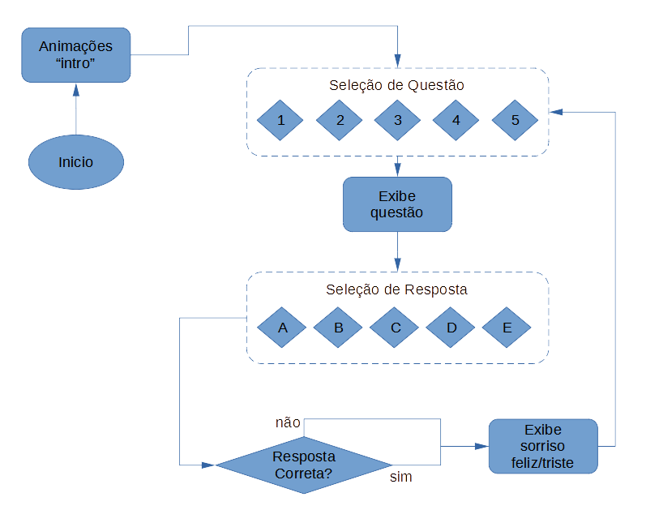

# BitDogLab_Math

BitDogLab_Math é um jogo de perguntas e respostas sobre matemática para a placa [BitDogLab](https://github.com/BitDogLab/BitDogLab). O jogo foi desenvolvido como projeto 1 da disciplina da FEEC/Unicamp IE323 - Sistemas Embarcados para ensino com abordagem STEM

  
Clique para saber mais sobre a disciplina.

  Sistemas Embarcados para ensino com abordagem STEM é uma disciplina da pós-graduação da FEEC-UNICAMP ofertada pelo professor Fabiano Fruett. O objetivo da matéria é desenvolver projetos que envolva IoT, eletrônica e IA com o intuito de levar ferramentas para os alunos do ensino fundamental e médio utilizando a abordagem STEM (Science, Technology, Engineering and Mathematics). [BitDogLab](https://cpg.fee.unicamp.br/lista/caderno_horario_show.php?id=1932).

O objetivo do projeto 1 da disciplina é familiarizar-se com a placa e ganhar autonomia para desenvolver o primeiro programa.  

## Motivação

O ensino da matemática é um desafio nas escolas brasileiras, tanto no ensino fundamental quanto no ensino médio. Segundo os dados de 2019 apresentados pelo Sistema de Avaliação do Ensino Básico (SAEB), uma taxa de apenas 5% dos estudantes da rede pública terminam o ensino médio com bons conhecimentos em matemática, apresentando uma preocupação com o ensino público mesmo antes da pandemia (G1, 2021). Tendo em vista contribuir neste desafio, este projeto traz o desenvolvimento de um software educacional com uso da placa BitDogLab (FRUETT, et al., 2024.) visando um complemento ao ensino de matemática em níveis de Ensino Fundamental (8º e 9º anos) e Ensino Médio.

## Manual de Instruções

Esta primeira versão do BitDogLab_Math contém 5 perguntas com 5 alternativas cada. Primeiramente são exibidas animações quando o software iniciado. Em seguida seleciona-se a questão pode meio do joystick analógico com movimentos esquerda/direita, a questão é exibida no display Oled. Pressiona-se a tecla A para confirmar a escolha e então o gráfico da questão é exibido na matriz de LEDs por um tempo. Quando a contagem regressina no display Oled acaba, passa-se à seleção de alterativas para resposta. Então, com movimentos esquerda/direita no joystick a matriz de LEDs exibe as letras A até E correspondentes às alternativas, e simultaneamente o display Oled exibe o texto da resposta. O usuário confirma a seleção pressionando o botão A. Finalmente são exibidas na matrix de LEDs imagens :) ou :( dependendo se a resposta foi correta ou errada. Após isso o programa volta para a seleção de perguntas e o processo se repete indefinidamente. Para encerrar, deve-se pressionar 2 vezes o botão próximo à bateria na parte traseira da BitDogLab.  
O fluxograma abaixo ilustra o funcionamento do programa:

## Itens da BNCC contemplados

A Base Nacional Comum Curricular (BNCC) é um documento criado pelo Ministério da Educação (MEC) que estabelece as diretrizes e conteúdos essenciais que devem ser abordados nas escolas brasileiras, desde a educação infantil até o ensino médio. A criação da BNCC remonta à Constituição de 1988 que prevê em seu artigo 210 a Base Nacional Comum Curricular. Ao longo dos anos essa necessidade vem sendo discutida e amadurecida, e em 2015 foi publicada a primeira versão da BNCC. Mais recentemente, em 14 de dezembro de 2018, foi homologada pela ministra da educação Rossiele Soares a versão atual da BNCC, documento de 470 páginas que pode ser baixado em http://basenacionalcomum.mec.gov.br/ (BNCC - Histórico, 2024). O presente projeto visa contemplar os seguintes itens abordados na BNCC:

1. (EM13MAT301) Resolver e elaborar problemas do cotidiano, da Matemática e de outras áreas do conhecimento, que envolvem equações lineares simultâneas, usando técnicas algébricas e gráficas, com ou sem apoio de tecnologias digitais.
2. (EM13MAT302) Construir modelos empregando as funções polinomiais de 1º ou 2º graus, para resolver problemas em contextos diversos, com ou sem apoio de tecnologias digitais.
3. (EM13MAT309) Resolver e elaborar problemas que envolvem o cálculo de áreas totais e de volumes de prismas, pirâmides e corpos redondos em situações reais (como o cálculo do gasto de material para revestimento ou pinturas de objetos cujos formatos sejam composições dos sólidos estudados), com ou sem apoio de tecnologias digitais.
4. (EM13MAT405) Utilizar conceitos iniciais de uma linguagem de programação na implementação de algoritmos escritos em linguagem corrente e/ou matemática.

Em 17 de fevereiro de 2022, o parecer CNE/CEB nº 2/2022 estabeleceu as normas sobre Computação na Educação Básica como um complemento à BNCC. Posteriormente, a Resolução CNE/CEB nº 1/2022, de 4 de outubro de 2022, reforçou essas normas, definindo os conteúdos e habilidades relacionados à Educação Digital que devem ser abordados nas escolas, o documento de 75 páginas ficou conhecido como BNCC Computação, que pode ser baixada em http://basenacionalcomum.mec.gov.br/historico (BNCC Histórico, 2024) (COUTINHO, 2024). O presente projeto relaciona-se à BNCC Computação, especificamente às habilidade do 8º e 9º anos do Ensino Fundamental, e ao Ensino Médio nos seguintes itens:

* A criação do jogo e sua programação em MicroPython estimulam habilidades essenciais de Pensamento Computacional, como:
  
5. (EF08CO02): Criar soluções de problemas para os quais seja adequado o uso de listas para descrever suas informações e automatizá-las usando uma linguagem de programação, empregando ou não a recursão como uma técnica de resolver o problema.
(EF09CO01): Criar soluções de problemas para os quais seja adequado o uso de árvores e grafos para descrever suas informações e automatizá-las usando uma linguagem de programação.
6. (EF69CO02): Descrever a estrutura de um algoritmo e traduzi-lo para uma linguagem de programação.
  
* A lógica do jogo, com perguntas aleatórias, exige a aplicação de algoritmos, seleção condicional e repetições, conectando-se com as habilidades:
  
7. (EM13CO01): Explorar e construir a solução de problemas por meio da reutilização de partes de soluções existentes.
8. (EM13CO02): Explorar e construir a solução de problemas por meio de refinamentos, utilizando diversos níveis de abstração desde a especificação até a implementação.
  
* O desenvolvimento do jogo e a interação com a plataforma BitDogLab abrem espaço para discutir:

9. (EM13CO20): Criar conteúdos, disponibilizando-os em ambientes virtuais para publicação e compartilhamento, avaliando a confiabilidade e as consequências da disseminação dessas informações.
  
* A utilização de um sistema de quiz, com feedback imediato, incentiva a autonomia e o aprendizado de:
10. (EM13CO15): Analisar a interação entre usuários e artefatos computacionais, abordando aspectos da experiência do usuário e promovendo reflexão sobre a qualidade do uso dos artefatos nas esferas do trabalho, do lazer e do estudo.

## Hardware 

O projeto está autocontido na placa denominada BitDogLab. A BitDogLab é uma placa de desenvolvimento de código aberto possuindo items de hardware como botões e leds que permitem a interação do usuário. Além disso, conta com contatos elétricos e conectores que permite a integração de uma variedade de sensores e atuadores, facilitando a criação de projetos em sistemas embarcados. Ela é baseada no microcontrolador Raspberry Pi Pico. A placa pode ser vista na figura abaixo. 

1. **Microcontrolador: RaspBerry Pi Pico:** O Raspberry Pi Pico é o cérebro do projeto, responsável por controlar os demais componentes e executar o código do jogo. Ele é programado em MicroPython e se comunica com todos os periféricos embarcados na BitDogLab.

2. **Joystick:** O joystick é utilizado para navegação entre as questões e as alternativas do quiz. Sua função principal é permitir que o jogador possa pular para a próxima questão ou alternativa.

3. **Matriz de LEDs 5x5:** A matriz de LEDs 5x5 é usada para exibir desenhos simples relacionados às perguntas do quiz. Esses desenhos podem servir como ilustrações ou dicas visuais para as perguntas.

4. **Display OLED:** O display OLED é utilizado para apresentar as perguntas e alternativas textualmente. Ele exibe o conteúdo principal do jogo, como as perguntas e as opções de respostas.

5. **Botões A e B:** Os botões A e B são usados como controles para confirmar a seleção de uma alternativa e para voltar a uma questão anterior ou desfazer uma escolha.

6. **Buzzer:** O buzzer é utilizado para gerar o som de animação da interface de apresentação.

## Software 

O programa está dividido em dois arquivos perguntas_respostas.py, um código auxiliar e projeto01.py, o programa principal.
perguntas_respostas.py contém a classe Question, onde se encontram os textos das perguntas e os textos das respostas.

O script principal projeto01.py está organizado da seguinte forma:
1. **Imports:** Importação de bibliotecas necessárias para o funcionamento.
2. **Inicialização de periféricos:** Inicialização dos dispositivos de hardware da BitDogLab (botões, display, leds).
3. **Constantes:** 
Esta seção permite mudar o volume e a velocidade da música introdutória. 
Contém desenhos que se usam na matriz de LEDs (letras, smiles) e notas da música introdutória. 

5. **Funcoes para apresentação:** Funções com animações visuais e sonoras para serem usadas na introdução do jogo.
6. **Sequencia de apresentação:** Parte que chama as funções de animação da introdução (quando se liga a placa).
7. **Perguntas e Respostas:** Carregamento das questões a partir de pergunta_resposta.py para projeto01.py
8. **Escolha de alternativas:** Contém funções de lógica e animações que ocorrem durante tela de resposta.
9. **Interface Principal:** Parte com loop principal do programa, que se alterna entre telas de perguntas e respostas.

## Desafios 

1. Elaborar questões consistentes na área da matemática de forma sucinta devido a limitação do display OLED, ou seja, basicamente tínhamos 80 caracteres por questão.
2. Codificar a transição das interfaces.
3. Criar interfaces de usuário intuitiva e atraente para o jogo de perguntas e respostas.

## Como instalar?

1. Instale a IDE Thonny a partir de [https://thonny.org/](https://thonny.org/).
2. Conecte a placa BitDogLab ao computador através de um cabo micro-USB.
3. Siga as instruções em [Introdução prática a BitDogLab](https://escola-4-ponto-zero.notion.site/Cap-tulo-02-Usando-o-IDE-Thonny-para-desenvolvimento-d5dce52947244cd6a64da4ba77831c7a) para certificar-se que a BitDogLab está sendo reconhecida no Thonny.
4. Baixe o código `projeto01.py` neste repositório.
5. No Thonny, acesse `Arquivo > Abrir` e localize o arquivo `projeto01.py` (por exemplo, na pasta Downloads).
6. Pressione o botão "play" (triângulo verde) para executar o programa na BitDogLab temporariamente.
7. Se a execução estiver correta e você quiser salvar o código na BitDogLab para executá-lo posteriormente, então:
8. se você desejar preservar o programa atual de sua BitDogLab, antes de prosseguir, salve o arquivo main.py existente em uma pasta de seu computador.
9. Agora, com a guia que contém `projeto01.py` ativa no Thonny vá em `Arquivo > Salvar como`.
10. Quando a caixa de seleção aparecer com "Raspberry Pi e Computador", selecione Raspberry Pi, clique sobre `main.py` para sobrescrever.
11. Pronto, você pode desconectar a BitDogLab e o programa pode ser executado (ou reiniciado) apertando o botão próximo à bateria.

## Referências

FRUETT, Fabiano; BARBOSA, F. P.; FRAGA, S. C. Z.; GUIMARÃES, P. I. A. Empowering STEAM Activities With Artificial Intelligence and Open Hardware: The BitDogLab. IEEE Transactions on Education, 2024.

G1. Apenas 5% dos alunos da rede pública terminam o ensino médio com conhecimentos adequados de matemática. G1, 24 fev. 2021. Disponível em: https://g1.globo.com/educacao/noticia/2021/02/24/apenas-5percent-dos-alunos-da-rede-publica-terminam-o-ensino-medio-com-conhecimentos-adequados-de-matematica.ghtml. Acesso em: 18 de agosto de 2024.

BRASIL. Ministério da Educação. Base Nacional Comum Curricular - Histórico. Disponível em: http://basenacionalcomum.mec.gov.br/historico . Acesso em: 18 ago. 2024.

BRASIL. Ministério da Educação. Base Nacional Comum Curricular: educação infantil e ensino fundamental. Brasília: MEC, 2017. Disponível em: http://basenacionalcomum.mec.gov.br/images/BNCC_EI_EF_110518_versaofinal_site.pdf . Acesso em: 15 de agosto de 2024.

BRASIL. Ministério da Educação. Base Nacional Comum Curricular - Computação Complemento à BNCC. Brasília: MEC, 2022. Disponível em: http://basenacionalcomum.mec.gov.br/images//historico/anexo_parecer_cneceb_n_2_2022_bncc_computacao.pdf . Acesso em: 18 ago. 2024.
	
COUTINHO, Dimítria. BNCC Computação: conheça o documento que orienta como levar tecnologia à sala de aula. Nova Escola, 13 jun. 2024. Disponível em: https://novaescola.org.br/conteudo/21884/entenda-bncc-computacional-tecnologia-educacao. Acesso em: 18 ago. 2024.
